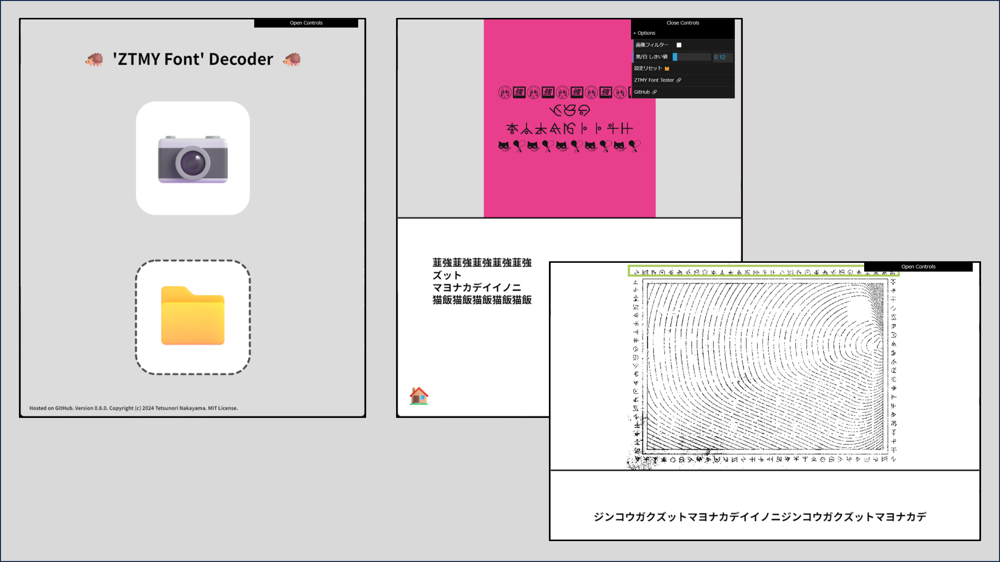

# ZTMY Font Decoder🦔
Version 0.8.0  

！！！書きかけ！！！

# Description🖊️
ZTMYフォントを解析（簡易OCR）できるツールです。精度はそこそこなので、あまり期待しないで🫠。  

# Usage🪄
## 📷を使って解析する場合
1. [ztmy-font-decoder](https://tetunori.github.io/ztmy-font-decoder/)にアクセスする。
2. 画面上半分の📷アイコンをタップする。
3. 解析したい部分をタッチで選択すると、画面下半分に解析結果が表示されます。

## 画像から解析する場合
1. [ztmy-font-decoder](https://tetunori.github.io/ztmy-font-decoder/)にアクセスする。
2. 画面下半分の📁アイコンをタップして、解析する画像を選択します。
3. 解析したい部分をタッチで選択すると、画面下半分に解析結果が表示されます。

なお、デフォルトのままで解析できるケースはほとんどないので、右上のコントローラーから以下も変更しつつ解析チャレンジしてみてください。
- 白黒画像化としきい値設定
- (上記の)設定の(猫)リセット
- [ztmy-font-tester](https://github.com/tetunori/ztmy-font-tester/)への移動
- GitHub(このページ)への移動

# License⚖️
Copyright (c) 2024 [Tetsunori Nakayama](https://github.com/tetunori). MIT License.

# Author🧙‍♂️
Tetsunori Nakayama

# References📚
## p5.js
[p5.js](https://github.com/processing/p5.js) by [Processing Foundation](https://github.com/processing). GNU Lesser General Public License v2.1.

## tesseract.js
[tesseract.js](https://github.com/naptha/tesseract.js) by [Naptha](https://github.com/naptha). Apache License 2.0.

## dat.gui
[dat.gui](https://github.com/dataarts/dat.gui) by [Google Data Arts Team](https://github.com/dataarts). Apache License 2.0.

## Emoji icons
Emoji icon pictures are from [fluentui-emoji](https://github.com/microsoft/fluentui-emoji) by [microsoft](https://github.com/microsoft). MIT License.
